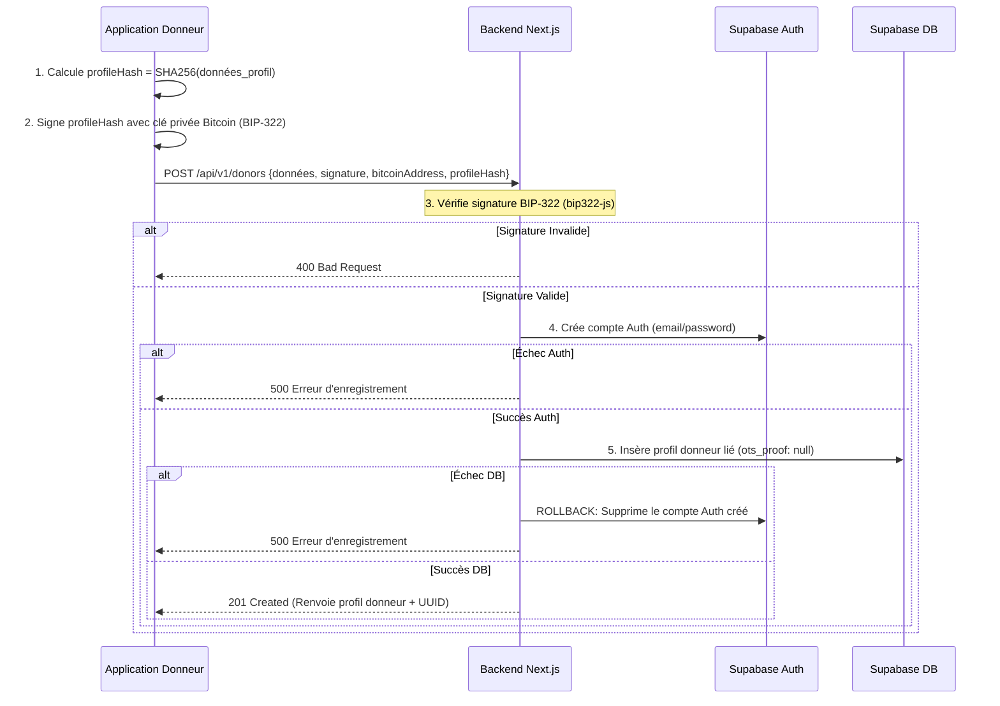
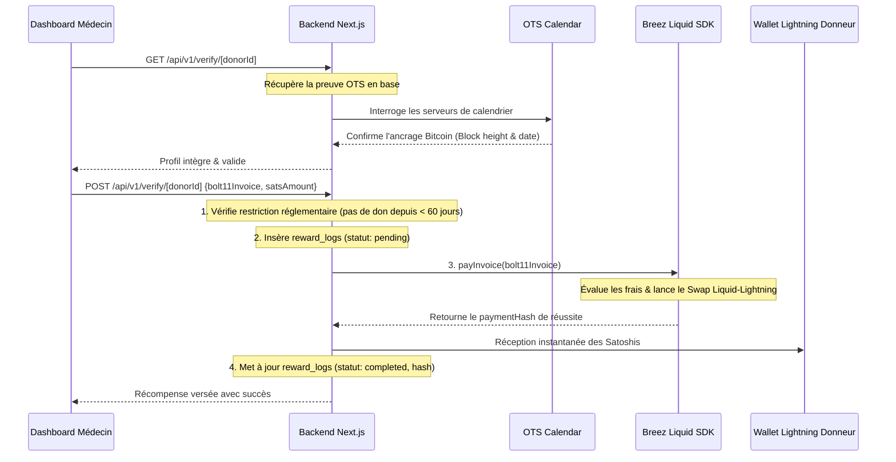

# 🩸 Bitcoin Blood (BMM) — Guide de Prise en Main Technique

Ce document est conçu pour permettre à un expert technique ou à un repreneur de comprendre instantanément l'architecture, les flux de données, les technologies clés et les conventions de développement de **Bitcoin Blood**.

---

## 🎯 Vue d'ensemble du projet

**Bitcoin Blood** (BMM) est une plateforme panafricaine innovante de gestion des donneurs de sang. Son objectif est de fluidifier le don de sang dans les situations d'urgence tout en garantissant :

1. **L'intégrité infalsifiable des profils médicaux** des donneurs (sans exposer de données privées) en les ancrant sur la blockchain Bitcoin via **OpenTimestamps** (OTS).
2. **La souveraineté et l'authenticité des comptes** en liant chaque profil à une clé cryptographique Bitcoin via des signatures **BIP-322**.
3. **La motivation des donneurs** par l'attribution instantanée de micro-récompenses en Satoshis via le **Lightning Network** (grâce à **Breez Liquid SDK** de manière non-dépositaire).
4. **La réactivité des structures sanitaires** via un moteur de recherche intelligent (**Blood Emergency AI**) et des campagnes de notifications ciblées (**EmailJS**).

---

## 🧱 Stack Technique Principale

| Couche                     | Technologie                                     | Rôle / Justification                                                                                                                                                            |
| :------------------------- | :---------------------------------------------- | :------------------------------------------------------------------------------------------------------------------------------------------------------------------------------ |
| **Framework**              | **Next.js 15 (App Router)**                     | Framework full-stack. API versionnée sous `/api/v1/` avec validation systématique.                                                                                              |
| **Base de Données**        | **Supabase (PostgreSQL)**                       | Hébergement de la base, gestion de l'authentification (`auth.users`) et politiques de sécurité **RLS** (Row Level Security).                                                    |
| **ORM / Accès DB**         | **Drizzle ORM**                                 | Configuration Drizzle présente pour le typage et l'infrastructure de migration, bien que le client natif de Supabase soit majoritairement utilisé pour les requêtes dynamiques. |
| **Validation**             | **Zod**                                         | Validation stricte au niveau API des données entrantes et sortantes.                                                                                                            |
| **Identité Bitcoin**       | **bip322-js**                                   | Vérification de possession de clé publique (adresse Bitcoin) par signature de message standardisée.                                                                             |
| **Blockchain (L1)**        | **javascript-opentimestamps**                   | Ancrage cryptographique des données de profil (via SHA-256) sur la blockchain Bitcoin.                                                                                          |
| **Lightning Network (L2)** | **@breeztech/breez-sdk-liquid**                 | Portefeuille Liquid non-dépositaire exécuté côté serveur pour régler les factures Lightning BOLT11 via swaps.                                                                   |
| **Notifications**          | **EmailJS (API REST)**                          | Envoi d'e-mails de campagnes par lots de 50 (via `fetch` natif sans dépendance additionnelle).                                                                                  |
| **Tests & Qualité**        | **Vitest**, **ESLint**, **Prettier**, **Husky** | Tests unitaires / d'intégration et linteurs appliqués sur les hooks de pré-validation git.                                                                                      |

---

## 🗂️ Architecture & Organisation du Code

L'application est structurée suivant une **architecture modulaire par domaine métier**. Chaque domaine métier vit dans `src/modules/<domaine>` et expose sa surface publique via un fichier `index.ts`. Les composants React ou les routes de l'API ne doivent jamais importer des sous-dossiers internes d'autres modules.

```
src/
├── app/
│   ├── api/v1/                   # Route Handlers Next.js (Points d'entrée HTTP)
│   │   ├── auth/                 # Inscription / Connexion organisations
│   │   ├── campaigns/            # Lancement et historique de campagnes
│   │   ├── donors/               # Inscription et liste de donneurs validés
│   │   ├── emergencies/          # CRUD des urgences déclarées
│   │   ├── health/               # Sonde de disponibilité
│   │   ├── search/               # Recherche par proximité géographique et ABO
│   │   └── verify/[id]/          # Scan QR de carte (GET) et Payout Lightning (POST)
│   ├── globals.css               # Design system et tokens CSS
│   ├── layout.tsx                # Structure commune de l'interface
│   └── page.tsx                  # Page d'accueil publique
├── components/                   # Composants UI globaux et partagés (Primitives shadcn)
├── config/                       # Fichiers de configuration applicative
├── lib/                          # Couche technique transverse
│   ├── api/                      # Standardisation des réponses, clients et erreurs HTTP
│   ├── db/                       # Instance Drizzle ORM et schémas SQL associés
│   ├── supabase/                 # Initialisation des clients Supabase (client & server)
│   └── env.ts                    # Validation stricte des variables d'environnement au démarrage
├── modules/                      # Domaines d'affaires isolés
│   ├── auth/                     # Gestion des comptes administrateurs d'hôpitaux et ONG
│   ├── bitcoin/                  # OTS, BIP-322, Breez SDK, validation des récompenses
│   ├── campaigns/                # Curation géographique et dispatch des e-mails
│   ├── donors/                   # Profils donneurs et persistance
│   ├── emergencies/              # Déclaration et résolution des urgences de sang
│   └── matching/                 # Intelligence de matching Blood Emergency AI
└── middleware.ts                 # Intercepteur global pour la session JWT de Supabase Auth
```

---

## 🗄️ Schéma de Base de Données

Le schéma relationnel PostgreSQL est managé par Supabase avec une stricte politique de **Row Level Security (RLS)** pour protéger les données de santé des donneurs.

```mermaid
erDiagram
    donors {
        uuid id PK "FK -> auth.users"
        varchar first_name
        varchar last_name
        varchar email UNIQUE
        varchar phone_number
        varchar blood_type "A+, A-, B+, B-, AB+, AB-, O+, O-"
        varchar city
        double latitude
        double longitude
        integer age
        boolean available
        boolean validated
        varchar bitcoin_address UNIQUE
        char profile_hash UNIQUE "SHA-256"
        text ots_proof "Base64 OTS"
        timestampz created_at
    }

    organizations {
        uuid id PK
        varchar name
        enum type "hospital | ong | collect"
        double latitude
        double longitude
        varchar city
        varchar contact_email
        boolean verified
        timestampz created_at
    }

    user_profiles {
        uuid id PK "FK -> auth.users"
        uuid organization_id FK "References organizations.id"
        enum role "super_admin | org_admin"
        timestampz created_at
    }

    emergencies {
        uuid id PK
        uuid hospital_id FK "References organizations.id"
        varchar blood_type
        integer quantity_needed
        varchar city
        double latitude
        double longitude
        varchar status "active | resolved | cancelled"
        timestampz created_at
    }

    campaigns {
        uuid id PK
        uuid hospital_id FK "References organizations.id"
        varchar title
        enum type "targeted | general"
        varchar target_blood_type
        varchar city
        double latitude
        double longitude
        integer radius_km
        integer emails_sent
        integer responses_count
        varchar status
        timestampz created_at
    }

    reward_logs {
        uuid id PK
        uuid donor_id FK "References donors.id"
        uuid hospital_id FK "References organizations.id"
        integer sats_amount
        enum status "pending | completed | failed"
        text bolt11_invoice
        varchar payment_hash UNIQUE
        text error_message
        timestampz created_at
    }

    organizations ||--o{ user_profiles : "possède"
    organizations ||--o{ emergencies : "déclare"
    organizations ||--o{ campaigns : "organise"
    donors ||--o{ reward_logs : "reçoit"
    organizations ||--o{ reward_logs : "finance"
```

### Règles RLS Clés

- **Donors** : Inscription publique autorisée (`INSERT`). Lecture autorisée pour tous (`SELECT`). Modification (`UPDATE`) restreinte uniquement aux rôles administratifs vérifiés (`super_admin` et `org_admin`).
- **IDOR Protection (Backend)** : En plus de la RLS, chaque Route Handler Next.js récupère l'ID de l'organisation de l'appelant depuis la session serveur Supabase (`user.organizationId`), bloquant toute tentative de manipulation des données d'un autre hôpital.

---

## 🔄 Flux Techniques Majeurs

### 1. Inscription d'un Donneur (Cryptographie & Blockchain)

L'inscription exige la preuve que le donneur possède les clés de l'adresse de réception Bitcoin fournie.



### 2. Validation d'un Don & Distribution de Récompense (Lightning Network)

Lorsqu'un donneur effectue son don de sang, le médecin scanne la carte du donneur et lui verse sa récompense en satoshis.



---

## 🧠 Blood Emergency AI & Matching

L'algorithme de ciblage des donneurs d'urgence (**Blood Emergency AI**) calcule un score d'adéquation sur `100` pour classer et identifier les donneurs les plus pertinents :

1. **Vérification de Compatibilité Sanguine (Strict)** : Utilise une table de compatibilité classique. Par exemple, pour un receveur $O-$, seuls les donneurs $O-$ sont sélectionnés.
2. **Score de Proximité Géographique (Formule de Haversine)** :
   $$\text{Score Distance} = \max(0, 100 - (\text{Distance en km} \times 5))$$
   _Exemple : Un donneur situé à 4 km aura un score de distance de $100 - (4 \times 5) = 80/100$._
3. **Score Bonus d'Historique de Dons (+10 pts par don)** :
   Les donneurs réguliers ayant déjà validé des dons dans le système (`reward_logs` en statut `completed`) reçoivent une majoration de $+10$ points par don (plafonné à $+40$ points).
4. **Calcul du Score Final** :
   Le score final pondéré détermine l'ordre d'affichage. Le système fournit également une explication textuelle (ex: _"Compatibilité parfaite (O-). Distance : 1.8 km. Donneur régulier (3 dons validés)."_).

---

## 🛠️ Modes de Simulation & Configuration Dev

Pour faciliter le développement local sans exiger de transactions réelles sur la blockchain ou des fonds Bitcoin, deux composants clés intègrent des modes de repli automatique :

### 1. Breez Liquid SDK

- **Simulation** : Activée si les variables d'environnement `BREEZ_API_KEY` ou `BREEZ_MNEMONIC` sont absentes, ou si la librairie native rencontre des limitations de compilation sous l'environnement de développement.
- **Comportement** : Génère un hash de transaction aléatoire factice de 64 caractères, simule le succès du paiement et passe les logs en base au statut `completed`.

### 2. EmailJS (Campagnes de notifications)

- **Simulation** : Activée si `EMAILJS_SERVICE_ID`, `EMAILJS_TEMPLATE_ID`, `EMAILJS_PUBLIC_KEY` ou `EMAILJS_PRIVATE_KEY` ne sont pas configurés.
- **Comportement** : Enregistre le lot de notifications ciblées dans la console d'exécution du serveur et marque la campagne comme active avec le décompte exact d'e-mails simulés.

---

## 🚀 Lancer le projet en Local

### 1. Fichier de Configuration (`.env`)

Copiez le fichier `.env.example` à la racine vers un fichier `.env` et ajustez les variables d'accès Supabase et PostgreSQL :

```env
NEXT_PUBLIC_APP_URL=http://localhost:3000
NEXT_PUBLIC_SUPABASE_URL=https://xxx.supabase.co
NEXT_PUBLIC_SUPABASE_ANON_KEY=eyJ...
SUPABASE_SERVICE_ROLE_KEY=eyJ...
DATABASE_URL=postgresql://postgres:...
```

### 2. Commandes Utiles

```bash
# Installer les dépendances
npm install

# Lancer le serveur Next.js en développement
npm run dev

# Exécuter les tests unitaires et d'intégration (Vitest)
npm run test

# Lancer l'analyse de couverture des tests
npm run test:coverage

# Valider les types, le formatage et les linteurs avant push
npm run validate

# Ouvrir Drizzle Studio pour visualiser les données en local
npm run db:studio
```

### 3. Scripts d'initialisation de Base de données

Les schémas SQL et les politiques RLS de Supabase sont configurés via les scripts situés dans le répertoire `./supabase_scripts/`. Ils doivent être appliqués dans l'éditeur de requêtes SQL de votre Dashboard Supabase dans l'ordre suivant :

1. `init.sql` (Tables fondamentales, profils, index, types énumérés et politiques RLS).
2. `emergencies.sql` (Intégrations des structures d'urgence).
3. `campaigns.sql` (Logique de campagne et relations géographiques).
4. `rewards.sql` (Gestion comptable des transactions et journalisation des Satoshis).

---

## ⏳ Prochaines Étapes

La base de code backend est validée par **38 tests unitaires** réussis, et **le frontend (PWA / Web App) est déjà opérationnel**.
Les prochaines étapes d'optimisation pourraient inclure :

1. **Support Hors-Ligne Renforcé (Service Workers)** : Mise en cache avancée pour permettre aux hôpitaux de consulter les profils en cas de coupure internet.
2. **Intégration USSD / SMS** : Permettre l'alerte et l'inscription des donneurs ne possédant pas de smartphone.
3. **Pont d'encaissement Fiat / Mobile Money** : Permettre aux donneurs de convertir facilement leurs récompenses Lightning en monnaie locale (ex: via Bitnob ou Kotani Pay).
