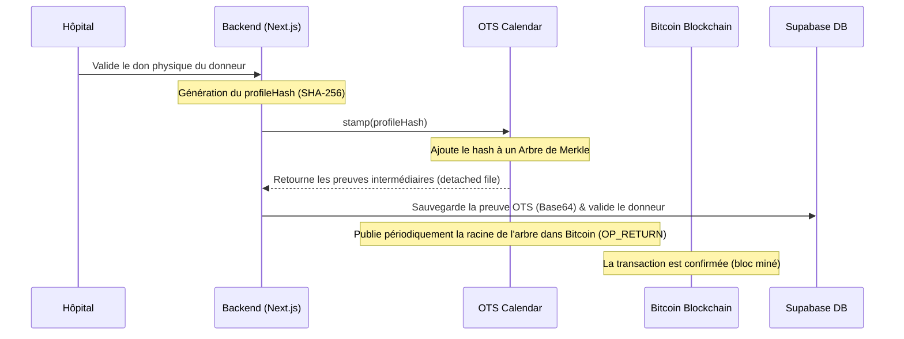
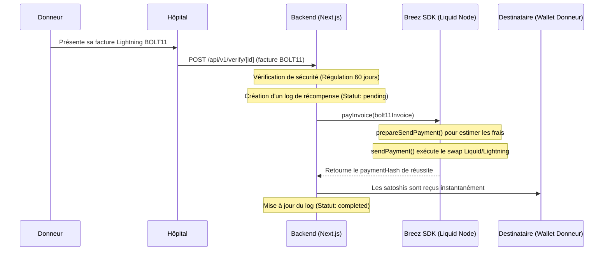

# Explications de l'intégration OpenTimestamps & Breez Liquid SDK dans Bitcoin Blood

Ce document décrit en détail comment la blockchain Bitcoin et le réseau Lightning sont exploités au sein du projet **Bitcoin Blood** pour garantir l'intégrité des profils de donneurs et automatiser la distribution de récompenses de manière non-dépositaire.

---

## 1. OpenTimestamps (Horodatage décentralisé)

### Pourquoi l'utiliser ?

Dans un système de don de sang, la confiance est primordiale. Il est essentiel de pouvoir prouver qu'un profil de donneur (contenant son groupe sanguin et ses informations clés) a été validé à un instant précis sans pour autant exposer ses données médicales privées sur une blockchain publique.
OpenTimestamps (OTS) résout ce problème en permettant de prouver l'existence d'un document (ici, un hash de données) à une date donnée en l'ancrant dans la blockchain Bitcoin, de manière gratuite et scalable.

### Comment ça marche dans le projet ?

1. **Création du hash (`profileHash`)** :
   Lorsqu'un donneur est validé par un hôpital après un don physique, le système calcule le hash SHA-256 du profil du donneur. Ce hash est une empreinte numérique unique. Toute modification ultérieure des informations du donneur (comme son groupe sanguin) modifierait complètement ce hash.

2. **Demande d'horodatage (`Stamp`)** :
   Le backend prend ce hash et utilise la bibliothèque `javascript-opentimestamps` pour créer un fichier d'horodatage détaché. Il envoie ensuite une requête aux **serveurs de calendrier OpenTimestamps**.
   Ces serveurs publics et gratuits reçoivent le hash et s'engagent à l'inclure dans un **arbre de Merkle** avec d'autres hashes.

3. **Génération de la preuve** :
   Le serveur de calendrier renvoie immédiatement une preuve d'horodatage temporaire (le chemin dans l'arbre de Merkle). Cette preuve est sérialisée sous forme d'octets, encodée en **Base64** et stockée dans la base de données PostgreSQL de Supabase (colonne `ots_proof` de la table `donors`).

4. **Ancrage sur Bitcoin** :
   Périodiquement (toutes les quelques secondes à minutes), le serveur de calendrier prend la racine de son arbre de Merkle et l'inclut dans une transaction Bitcoin standard via l'instruction `OP_RETURN`. Une fois cette transaction insérée dans un bloc Bitcoin et confirmée par le réseau, l'horodatage est définitif et infalsifiable.

5. **Vérification de la preuve (`Verify`)** :
   Lorsqu'une entité tierce (par exemple lors d'un scan de QR Code sur une carte physique) souhaite vérifier le profil :
   - Le backend récupère le `profileHash` et la preuve `ots_proof` (Base64) depuis la base de données.
   - La méthode de vérification reconstitue le chemin de l'arbre de Merkle jusqu'à la transaction Bitcoin.
   - Si la transaction est présente et confirmée sur Bitcoin, OpenTimestamps renvoie avec certitude la **hauteur du bloc** (block height) et la **date exacte de confirmation** (timestamp).
   - Si le profil avait été falsifié, le hash calculé ne correspondrait plus à la preuve OTS, et la vérification échouerait.

---

## 2. Breez Liquid SDK (Distribution de récompenses Lightning)

### Pourquoi l'utiliser ?

Pour inciter au don de sang, le projet attribue des récompenses en Satoshis (la plus petite unité de Bitcoin). Utiliser la blockchain Bitcoin principale (Layer 1) serait trop lent et extrêmement coûteux en frais de transaction. Le réseau **Lightning Network** (Layer 2) permet des micro-paiements instantanés et à frais quasi-nuls.
Le SDK **Breez Liquid** permet d'intégrer un nœud Lightning non-dépositaire directement dans l'application backend sans avoir à gérer une infrastructure lourde.

### Comment ça marche dans le projet ?

1. **Initialisation du nœud Breez** :
   Le backend initialise de manière autonome un nœud Liquid (sidechain Bitcoin rapide orientée micro-paiements) en utilisant :
   - Une phrase mnémonique secrète de 12 ou 24 mots (`BREEZ_MNEMONIC`) qui fait office de clé privée pour le portefeuille.
   - Une clé API Breez (`BREEZ_API_KEY`).
   - Un répertoire local d'état (`BREEZ_WORKING_DIR`) pour stocker la base de données interne du nœud.
     Selon l'environnement (`production` ou `development`), le nœud se connecte au réseau principal (Mainnet) ou de test (Testnet).

2. **Présentation de la facture BOLT11** :
   Après son don de sang, le donneur génère sur son propre portefeuille (ex: Phoenix, Breez, Wallet of Satoshi) une **facture BOLT11** (un QR Code de paiement Lightning) du montant convenu (ex: 1000 satoshis) et la présente à l'hôpital.

3. **Paiement de la facture** :
   L'hôpital soumet cette facture au backend via l'API. Le service Breez réalise le paiement en deux étapes :
   - **Évaluation des frais (`prepareSendPayment`)** : Analyse de la facture et calcul des frais du réseau nécessaires pour acheminer les satoshis.
   - **Envoi des fonds (`sendPayment`)** : Le nœud Breez du serveur retire les satoshis du solde Liquid de l'organisation, réalise un swap décentralisé vers le réseau Lightning, et règle la facture BOLT11 du donneur.
   - Une fois payé, Breez retourne un **hash de paiement** (paymentHash) unique qui sert de reçu cryptographique.

4. **Mode Simulation (Fallback)** :
   Pour faciliter le développement et les tests sans nécessiter de fonds réels ni de configuration complexe, le service Breez dispose d'une simulation automatique. Si le SDK n'est pas disponible ou si les clés privées ne sont pas configurées, le système simule le paiement en générant un hash de transaction factice et valide l'opération en base de données.

---

## 3. Le Flux de Données Complet (Flow du Projet)

Voici comment s'enchaînent toutes les technologies du projet lors du parcours de vie d'un donneur :

### Étape 1 : Inscription du Donneur

1. Le donneur remplit le formulaire d'inscription sur l'application (données personnelles, groupe sanguin, adresse Bitcoin).
2. Pour s'assurer que le donneur possède réellement l'adresse Bitcoin saisie, le système vérifie une **signature BIP-322** (preuve de possession cryptographique).
3. Si la signature est valide, l'inscription est créée dans Supabase Auth.
4. Un `profileHash` est calculé, et **OpenTimestamps** crée la preuve d'horodatage initiale.
5. Le profil du donneur est enregistré en base avec sa preuve OTS. Un QR Code contenant l'UUID unique du donneur est généré sur sa carte physique/numérique.

### Étape 2 : Déclaration d'une Urgence Hospitalière

1. Un médecin constate un manque de sang O- à l'hôpital.
2. Il crée une alerte d'urgence sur la plateforme.
3. Le système utilise l'algorithme **Blood Emergency AI** pour chercher les donneurs compatibles les plus proches en calculant un score sur 100 basé sur :
   - La distance géographique (formule de Haversine).
   - La compatibilité exacte du groupe sanguin.
   - L'historique des dons précédents (donneurs réguliers prioritaires).
4. Le médecin obtient une liste ordonnée et peut lancer une campagne de notification par email.

### Étape 3 : Validation du Don & Distribution de Récompense

1. Un donneur notifié se rend à l'hôpital et effectue son don de sang.
2. Le médecin scanne le QR code de la carte du donneur.
3. L'application appelle le endpoint public `/api/v1/verify/[id]` qui effectue la vérification de la preuve **OpenTimestamps** pour s'assurer que la carte et les données médicales associées n'ont pas été falsifiées.
4. Le médecin valide le don physique (le donneur passe au statut validé).
5. Le médecin initie le paiement de la récompense en transmettant la facture Lightning BOLT11 du donneur.
6. Le backend vérifie d'abord que le donneur n'a pas déjà reçu de récompense au cours des **60 derniers jours** (sécurité réglementaire anti-abus).
7. Le backend enregistre une trace en statut `pending` dans les journaux d'audit (`reward_logs`).
8. Le service **Breez Liquid SDK** est appelé pour régler la facture.
9. Dès confirmation du paiement, les journaux d'audit passent au statut `completed` avec le hash de la transaction, et le donneur reçoit ses satoshis en quelques secondes sur son mobile.
